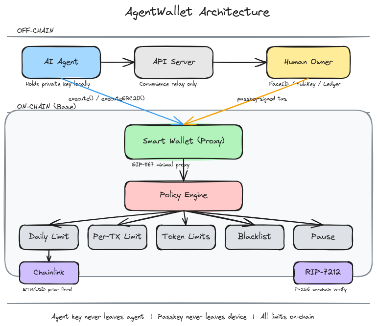

# AgentWallet

Non-custodial, gas-sponsored smart wallets for AI agents on Base.

Your agent gets a real wallet with free gas, spending limits, and human control via FaceID — all enforced by smart contracts, not trust.

```bash
npx @0xartex/agentwallet create --agent 0xYourAgentAddress
```

## Why

AI agents need to spend money. But giving an agent an unlimited wallet is terrifying.

**AgentWallet** solves this:
- **Gas-sponsored** — every wallet gets free gas on creation. Your agent can transact immediately, no ETH needed for fees
- **Hard spending limits** — $50/day, $25/tx by default, enforced by the smart contract
- **Human oversight** — passkey (FaceID/YubiKey) controls limits, pause, and withdrawals
- **Non-custodial** — agent's private key never leaves the agent's machine. We literally cannot touch your funds.

No custody. No trust. No "we promise we won't steal your funds." Architecturally impossible.

## How It Works



```
Agent creates wallet → Human registers passkey → Agent transacts within limits
                              ↓
                     Human can: raise/lower limits,
                     pause, set token limits,
                     blacklist addresses, withdraw
```

### Limit tracking

| Asset | Tracking | Limits |
|-------|----------|--------|
| **ETH** | Converted to USD via Chainlink oracle | Shared USD daily/per-tx limit |
| **USDC** | Tracked at face value (1:1) | Same shared USD limit as ETH |
| **Other ERC-20s** | Unlimited by default | Owner can set per-token limits |

ETH and USDC spending is **aggregated** — if the daily limit is $50, spending $30 in ETH leaves $20 for USDC (and vice versa).

### Wallet modes

| Mode | Owner | Use case |
|------|-------|----------|
| **Managed** | Human (via passkey) | Production agents with human oversight |
| **Unmanaged** | Agent itself | Autonomous agents, no human in the loop |

## Complete Guide: From Zero to Transacting

### Step 1: Generate an agent keypair

Your agent needs an EVM keypair. The **public address** identifies your agent on-chain. The **private key** is what your agent uses to sign transactions from the wallet.

```bash
npx @0xartex/agentwallet keygen
```

```
  New Agent Keypair
  ─────────────────────
  Address         0xB042...B7DC
  Private key     0x282a...b3a3

  Save the private key securely — your agent needs it to sign transactions.
  Never share it. Never commit it to git.

  Create a wallet with this key:
  $ agentwallet create --agent 0xB042...B7DC
```

> **Already have a keypair?** If your agent uses ethers.js, viem, or any EVM library, you already have one. Use that public address as `--agent`.

### Step 2: Create a wallet

```bash
# Managed — human registers passkey to control limits
npx @0xartex/agentwallet create --agent 0xYourAgentAddress

# Unmanaged — fully autonomous, no human needed
npx @0xartex/agentwallet create --agent 0xYourAgentAddress --unmanaged
```

For managed wallets, you'll get a **setup URL**. Send it to your human. They open it, set spending limits, and register their passkey (FaceID/fingerprint/YubiKey). That's the one-time setup.

Every wallet gets **free gas** on creation (~$0.07, enough for ~140 transactions on Base).

### Step 3: Fund the wallet

Send ETH and/or USDC to the wallet address on **Base** (chain ID 8453). Any standard transfer works. Your agent doesn't need to hold ETH for gas — it's already funded and ready to go.

### Step 4: Transact

Your agent calls the wallet contract directly using its private key:

```typescript
import { Wallet, Contract, JsonRpcProvider, parseEther } from 'ethers'

// Your agent's private key (from step 1)
const AGENT_KEY = '0x282a...'
// Your wallet address (from step 2)
const WALLET = '0x...'

const provider = new JsonRpcProvider('https://base-rpc.publicnode.com')
const agent = new Wallet(AGENT_KEY, provider)

// Minimal ABI — only the functions your agent needs
const wallet = new Contract(WALLET, [
  'function execute(address to, uint256 value, bytes data) external',
  'function executeERC20(address token, address to, uint256 amount) external',
  'function getSpentToday() external view returns (uint256)',
  'function getRemainingDaily() external view returns (uint256)',
], agent)

// Send ETH
await wallet.execute(
  '0xRecipientAddress',  // to
  parseEther('0.001'),   // value in wei
  '0x'                   // empty data for simple transfer
)

// Send USDC (6 decimals)
const USDC = '0x833589fCD6eDb6E08f4c7C32D4f71b54bdA02913'
await wallet.executeERC20(USDC, '0xRecipient', 5_000_000n) // 5 USDC

// Call any contract (e.g. swap on Uniswap)
const swapData = '0x...' // encoded function call
await wallet.execute('0xRouterAddress', parseEther('0.01'), swapData)

// Check remaining budget
const remaining = await wallet.getRemainingDaily() // in USDC units (6 decimals)
console.log(`Remaining today: $${Number(remaining) / 1e6}`)
```

Every transaction is checked against your spending limits on-chain. If it exceeds the daily or per-tx limit, it **reverts instantly** — no approval queue, no waiting.

### Step 5: Check your wallet

```bash
npx @0xartex/agentwallet status 0xYourWallet
```

```
  Wallet
  ────────────────
  Address         0x01Ab...0f03
  Owner           Passkey (FaceID/YubiKey)
  Chain           base
  Paused          No

  Spending        ███░░░░░░░░░░░░░░░░░░░░░░░░░░░ 3%
  Spent today     $1.53 / $50
  Remaining       $48.47
  Per-tx limit    $25
  Gas balance     0.001178 ETH
```

### Step 6: Need higher limits?

```bash
npx @0xartex/agentwallet limits 0xWallet --daily 200 --pertx 100 --reason "Trading requires higher limits"
```

Returns a URL. Send it to your human → they review → authenticate with passkey → limits updated on-chain.

## All Commands

```bash
npx @0xartex/agentwallet keygen                        # generate agent keypair
npx @0xartex/agentwallet create --agent 0x...          # managed wallet
npx @0xartex/agentwallet create --agent 0x... --unmanaged  # autonomous wallet
npx @0xartex/agentwallet status 0xWALLET               # wallet info + balances
npx @0xartex/agentwallet limits 0xWALLET --daily 200 --pertx 100
npx @0xartex/agentwallet token-limit 0xWALLET --token 0xTOKEN --token-daily 1000 --token-pertx 300
npx @0xartex/agentwallet rm-token 0xWALLET --token 0xTOKEN
npx @0xartex/agentwallet pause 0xWALLET
npx @0xartex/agentwallet unpause 0xWALLET
npx @0xartex/agentwallet stats
```

All commands support `--json` for machine-readable output.

## Contracts

### Architecture

- **AgentWallet** — minimal proxy (EIP-1167) smart wallet with dual-mode ownership (EOA or passkey)
- **AgentWalletFactory** — deploys wallets via CREATE2 (deterministic addresses), seeds gas
- **PasskeyVerifier** — on-chain P-256 signature verification via RIP-7212 precompile

### Deployments

**Base Mainnet**
| Contract | Address |
|----------|---------|
| Factory | [`0x77c2a63BB08b090b46eb612235604dEB8150A4A1`](https://basescan.org/address/0x77c2a63BB08b090b46eb612235604dEB8150A4A1) |
| Implementation | [`0xEF85c0F9D468632Ff97a36235FC73d70cc19BAbA`](https://basescan.org/address/0xEF85c0F9D468632Ff97a36235FC73d70cc19BAbA) |
| Chainlink ETH/USD | [`0x71041dddad3595F9CEd3DcCFBe3D1F4b0a16Bb70`](https://basescan.org/address/0x71041dddad3595F9CEd3DcCFBe3D1F4b0a16Bb70) |
| USDC | [`0x833589fCD6eDb6E08f4c7C32D4f71b54bdA02913`](https://basescan.org/address/0x833589fCD6eDb6E08f4c7C32D4f71b54bdA02913) |

**Base Sepolia (testnet)**
| Contract | Address |
|----------|---------|
| Factory | `0x8eD17B67B8C1A24020236987BeD28F9609e93B06` |
| Implementation | `0xFB93e5245303827426Fb1A40D9168Cb738de1F2f` |
| Mock Oracle | `0x65E246C24118CF6439152d725Ad0072ce469805c` |

## Security Model

1. **Agent key** — can execute transactions within policy limits only
2. **Owner (passkey)** — can change limits, pause, blacklist, withdraw. Private key lives in device secure enclave (never exported)
3. **Backend** — relays passkey-signed transactions to chain. Cannot forge signatures. If compromised, on-chain limits still hold.
4. **Oracle** — Chainlink ETH/USD feed (8 decimals, aggregated from multiple sources). 1-hour staleness check prevents stale price exploitation.

The backend is a **convenience layer** — all security-critical logic is on-chain. An agent can interact with the contracts directly, bypassing the API entirely.

## Other Ways to Use AgentWallet

The CLI is the recommended way. But you can also:

- **SDK** — `import { AgentWallet } from '@0xartex/agentwallet'` for programmatic use in Node.js/TypeScript
- **REST API** — `POST https://agntos.dev/wallet/wallet` for direct HTTP calls
- **Direct contract calls** — interact with the smart contracts on Base without any middleware

See the [SKILL.md](SKILL.md) for full API reference.

## Self-Hosted

```bash
git clone https://github.com/0xArtex/agentwallet-aos
cd agentwallet-aos/src && npm install && npm run build

ADMIN_PRIVATE_KEY=0x... \
FACTORY_ADDRESS=0x77c2a63BB08b090b46eb612235604dEB8150A4A1 \
BASE_RPC=https://base-rpc.publicnode.com \
ETH_USD_ORACLE=0x71041dddad3595F9CEd3DcCFBe3D1F4b0a16Bb70 \
USDC_ADDRESS=0x833589fCD6eDb6E08f4c7C32D4f71b54bdA02913 \
node dist/api/server.js
```

Then: `npx @0xartex/agentwallet create --agent 0x... --url http://localhost:3002`

## Project Structure

```
cli/                          ← npm package (@0xartex/agentwallet)
contracts/base/               ← Solidity smart contracts (45 Forge tests)
contracts/solana/             ← Solana program (coming soon)
src/api/                      ← REST API server
src/base/                     ← Base wallet client + ABIs
src/web/                      ← Passkey setup + approval pages
docs/                         ← Architecture diagram
```

## License

MIT
